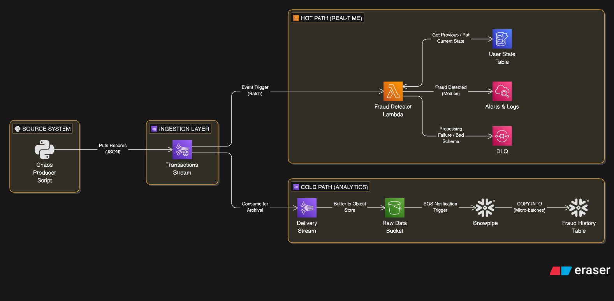

# Real-Time Fraud Detection Platform (AWS + Snowflake)

## Overview
An event-driven data platform designed to detect payment fraud in real-time while archiving data for historical analysis. This project demonstrates a "Split-Brain" architecture: detecting sub-second fraud patterns using **AWS Lambda/DynamoDB** while performing complex historical analysis (SCD Type 2) using **Snowflake**.

## Architecture

### The Stack
* **Ingestion:** AWS Kinesis Data Streams (Provisioned Mode)
* **Hot Path (Real-Time):** AWS Lambda (Python) -> DynamoDB (State Store)
* **Cold Path (Analytics):** Kinesis Firehose -> S3 -> Snowpipe -> Snowflake
* **Reliability:** SQS Dead Letter Queues (DLQ) & CloudWatch Alarms
* **IaC:** Terraform (Modular)

## Key Features
1.  **Idempotency:** Handling duplicate events from the producer.
2.  **Geo-Velocity Checks:** Calculating "impossible travel" speed between transactions.
3.  **Chaos Engineering:** Producer script intentionally generates malformed, late, and duplicate data.